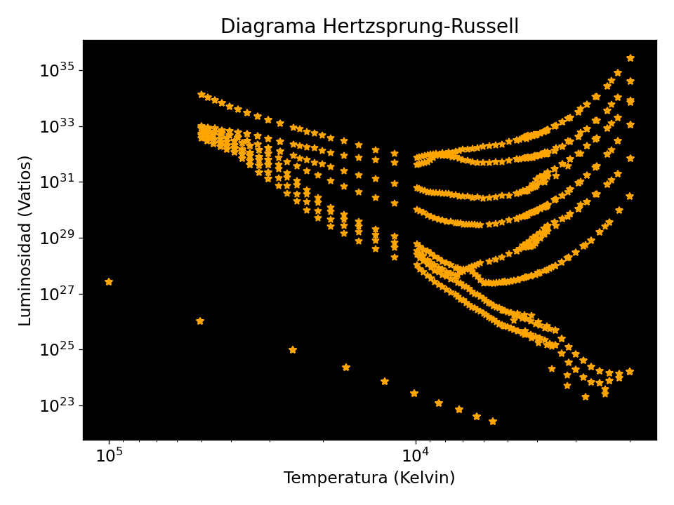
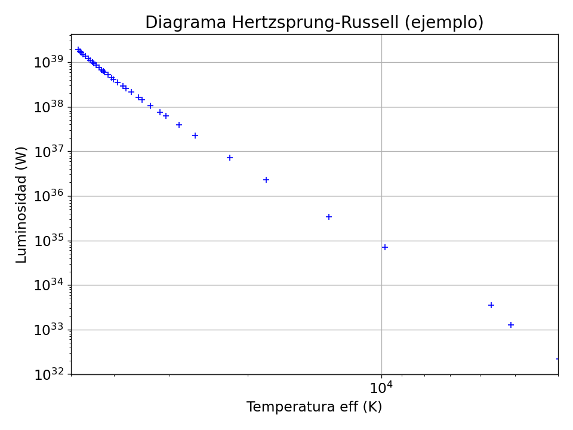
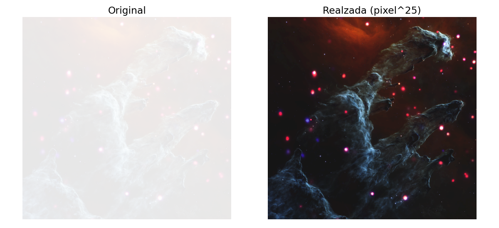
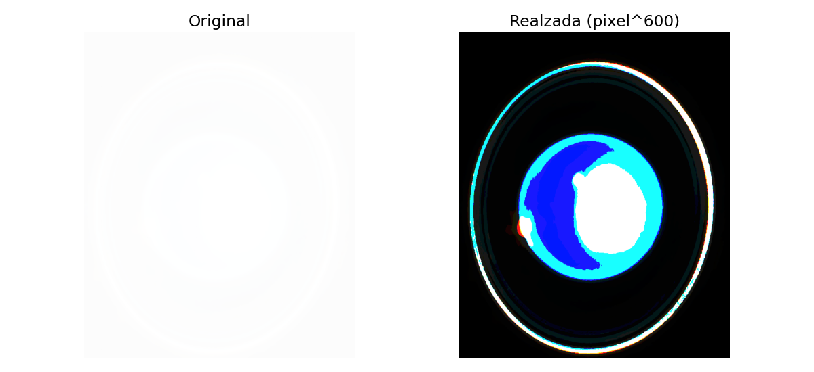
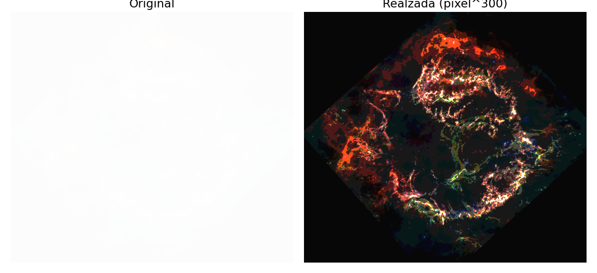
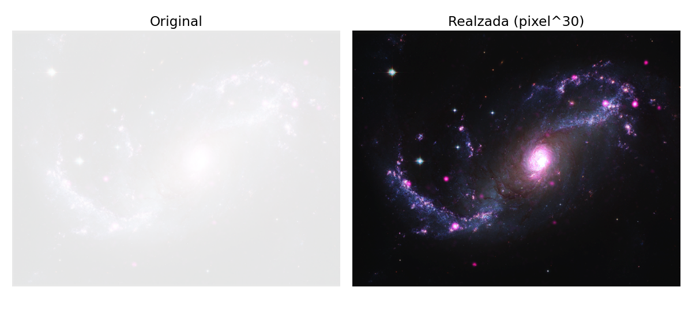

# python-astronomia

Uso de Python para procesar y analizar datos astronómicos.

Repositorio de ejercicios prácticos que introducen la programación en Python aplicada a la astronomía: desde lógica básica, pasando por la lectura de tablas de datos estelares y la construcción del **diagrama Hertzsprung-Russell (HR)**, hasta el tratamiento de **imágenes astronómicas como matrices** con NumPy y Matplotlib.

## Contenido

| Notebook | Tema | Resumen |
|---|---|---|
| [S1_Camilo_Castaneda.ipynb](S1_Camilo_Castaneda.ipynb) | Fundamentos de Python | Ciclos y funciones: serie de Fibonacci, patrones de asteriscos y generación del triángulo de Pascal. |
| [S3_Camilo_Castaneda.ipynb](S3_Camilo_Castaneda.ipynb) | Datos estelares y diagrama HR | Lectura de tablas con `np.loadtxt`, gráficos con Matplotlib y construcción del diagrama HR (temperatura efectiva vs. luminosidad) en unidades de $L_\odot$ y en vatios. |
| [S4_camilo_castaneda.ipynb](S4_camilo_castaneda.ipynb) | Imágenes como matrices | Manipulación de matrices de píxeles (filas/columnas) y realce de contraste de fotografías astronómicas mediante potencias sobre los valores de intensidad. |

## Datos

| Archivo | Columnas | Descripción |
|---|---|---|
| [datos_estrella.txt](datos_estrella.txt) | id, masa ($M_\odot$), luminosidad (W), temperatura (K) | Secuencia de estrellas de 0.5 a 60 masas solares usada en el ejemplo de diagrama HR. |
| [datos_camilo/tabla_camilo_HR_LS.txt](datos_camilo/tabla_camilo_HR_LS.txt) | id, masa, luminosidad ($L/L_\odot$), temperatura (K) | Datos para el diagrama HR en luminosidades solares. |
| [datos_camilo/tabla_camilo_HR_W.txt](datos_camilo/tabla_camilo_HR_W.txt) | id, masa, luminosidad (W), temperatura (K) | Mismos datos con luminosidad en vatios. |
| [datos_camilo/tabla_camilo.txt](datos_camilo/tabla_camilo.txt) | 3 columnas numéricas | Tabla de prueba para practicar lectura y graficación. |

## Resultados

### Diagrama Hertzsprung-Russell ([S3](S3_Camilo_Castaneda.ipynb))

Luminosidad vs. temperatura efectiva en escala logarítmica, con el eje de temperatura invertido como es convención en astronomía.

| Luminosidad en $L/L_\odot$ | Luminosidad en vatios |
|:---:|:---:|
|  |  |

<p align="center">
  <br>
  <em>Ejemplo: secuencia de estrellas de 0.5 a 60 masas solares (<code>datos_estrella.txt</code>).</em>
</p>

### Realce de imágenes astronómicas ([S4](S4_camilo_castaneda.ipynb))

Las fotografías originales están intencionalmente sobreexpuestas (valores de píxel cercanos a 1). Al elevar cada píxel a una potencia alta, los valores menores que 1 se reducen mucho más que los cercanos a 1, lo que recupera el contraste y revela la estructura oculta.

**Pilares de la Creación** – `imagen1.png`, `img ** 25`


**Planeta con anillos (posiblemente Urano)** – `imagen2.png`, `img ** 600`


**Remanente de supernova (posiblemente Cassiopeia A)** – `imagen3.png`, `img ** 300`


**Galaxia espiral** – `imagen4.png`, `img ** 30`


## Requisitos

- Python 3
- [NumPy](https://numpy.org/)
- [Matplotlib](https://matplotlib.org/)
- Jupyter Notebook / JupyterLab (o VS Code con la extensión de Jupyter)

```bash
pip install numpy matplotlib jupyter
```

## Uso

```bash
git clone <url-del-repositorio>
cd python-astronomia
jupyter notebook
```

Abre cualquiera de los notebooks y ejecuta las celdas en orden. Las rutas a los datos e imágenes son relativas a la raíz del repositorio.

## Autor

Camilo A. Castañeda G.
